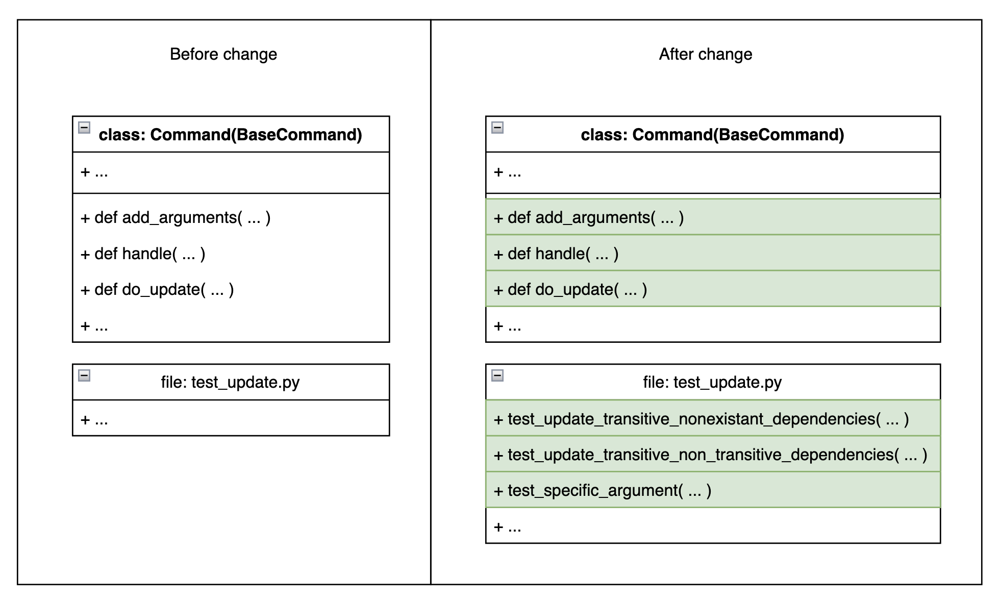

# Report for assignment 4

## Project

**Name:** PDM

**URL:** https://github.com/pdm-project/pdm

A package manager for python projects.

## Onboarding experience

We continued with the project we worked on in assignment 3. Below is our onboarding experience from the project report for assignment 3.

The project has a good CONTRIBUTING.md, where clear instructions are given
on how to organize ones contribution. The project recomends using it's own 
product (PDM) to ensure formatting and linting and to document changes in 
a specific `news` directory. There is nothing wrong with the CONTRIBUTING 
file, but there is a lack of documentation of certain modules and the code 
in general. The instructions and documentation for running and using the 
product are very good and the product works as intended. 

**How easily can you build the project? Briefly describe if everything worked as documented or not:**

- **a) Did you have to install a lot of additional tools to build the software?**

    No we only needed to install PDM, and it handled the rest for us.

- **b) Were those tools well documented?**

    PDM itself is well documented on the user side.

- **c) Were other components installed automatically by the build script?**

    PDM automatically installs all the necessary dependencies.

- **d) Did the build conclude automatically without errors?**

    Yes, this is very well handled by PDM.

- **e) How well do examples and tests run on your system(s)?**

    It runs excellently. With single scripts `pdm test` and `pdm coverage`, the tests and test coverage is executed with `pytest`.

## Requirements related to the issue
The requirements of the issue weren't entirely laid out in the issue itself. The [issue](https://github.com/pdm-project/pdm/issues/2628) mainly contained the functionality that the new feature should have. But by looking at old pull requests and the existing test cases, we were able to identify a few key requirements:

|ID | Name | Description|
----|------|-------------|
**1**| Updating sub-dependency| Running `pdm update --include-transitive <sub_dependency>`for a sub-dependency in the lock file should update it and update the lock file.|
**2**| Unknown sub-dependency should throw error| Running `pdm update --include-transitive <sub_dependency>` for a sub-dependency not in the lock file should throw an error. The update command is not supposed to add dependencies. | 
**3** | Passing direct dependencies should update as usual| Running `pdm update --include-transitive <dependency>` for a direct dependency in the pyproject.toml file should update as usual. This should be equal to just runningn`pdm update <dependency>`.|
**4** | Mixing dependencies and sub-dependencies is possible| Passing a mix of direct and sub-dependencies should update both the dependencies and the sub-dependencies. It should therefore be possible to run the command `pdm update --include-transitive <dependency> <subdependency>`. Note that `<subdependency>` doesn't have to be a dependency to `<subdependency>` here.
**5** | Updating a sub-dependency doesn't add it as dependency| Updating a sub-dependency should not add it as a direct dependency in the pyproject.toml file.

Additionally, we should add completion for any arguments added to the CLI interface. This is so a user can type `pdm update --i` and then press TAB so it autocompletes to `pdm update --include-transitive`.

### Project plan for testing
1. **ID 1**: This is the very core of the issue and can be tested by first adding a dependency with a specific sub-dependency, asserting that it has a specific version, updating the sub-dependency and then asserting that the sub-dependency has an updated version. The one difficulty with this is adding a dependency with a sub-dependency that is not the latest version so that it can then be updated.
2. **ID 2**: PDM uses mocking tools which means that it is easy to simulate `pdm` commands. Here we can write a test that tries to update a sub-dependency that does not exist in the lock file. Then we can assert that this throws an error.
3. **ID 3**: This can easily be tested by updating a regular dependency but including the `--include-transitive` flag. Then we can assert that the dependency has a new version.
4. **ID 4**: This just involves a combination of the tests for ID 3 and ID 1. Write a test that updates both a dependency and a sub-dependency and assert that they get new versions.
5. **ID 5**: Here we can update the sub-dependency and then look at the pyproject.toml file to ensure that the sub-dependency has not been added as a direct dependency.

## Overview of the architecture and purpose of pdm

A package manager is a system for handling the dependencies (or "packages") of a project. It finds the correct package files in a remote repository, checks them for vulnerabilities, downloads them and puts them in the correct locations. It also does this for all the package's sub-dependencies and removes all the appropriate files when the user wants to remove packages. `pdm` is a package manager for python and its purpose is to provide extra flexibility and customizability compared to other existing python package managers like Poetry and Hatch. 

### Overview of PDM
**Build system** 
`pdm` uses a PEP 517 build backend, which is a build-system independent format, instead of relying on a tightly integrated built-in build backend like Poetry and Hatch does. This makes it possible for the user to choose their own build backend.

**Metadata** 
One of the features of pip is that it uses PEP 621 for project metadata and supports the latest PEP standard. The core metadata is described in a `pyproject.toml` file according to the latest standards which eliminates previous ambiguities. An example of this is that it is required to declare if metadata is static or dynamic.

**Resolving** 
When a new dependency is added, removed or updated `pdm` runs a series of check to make sure that the new set of dependencies are valid and there are no conflicts between dependencies. If there is, `pdm` tries to update and alter the versions within allowed ranges. 

**Lock file** 
`pdm` generates a lock file `pdm.lock` with the resolved result of all dependencies. locking in a package manager means locking down the versions of the dependencies that are used in the project. The function `do_lock` in `src/pdm/cli/actions.py` does that locking as well as updates the lock file. 

**CLI interface** 
The CLI interface consists of an extensive list of commands and options for initializing and managing the dependencies in the project. Below are a few examples of common CLI commands.
- `init` - initializes a pyproject.tom
- `add` - add packages to pyproject.toml and install them
- `build` - build artifacts for distribution 
- `remove` - removes files that match the argument pattern. 
- `update` - all packages or only a specified package. `--update-eager` is an option for `pdm` to try to update the packages and their dependencies recursively. Another example of an option is `--update-all` which updates all packages in the toml file and their subdependencies. 

For a more detailed overview of CLI commands and their options visit https://pdm-project.org/latest/reference/cli/

**Plugin System** 
This is a system that allows user to develop new `pdm` commands and command options and share them to the community. To develop a new command the user uses inheritance from a BaseCommand class and can add arguments with add_arguments and tether actions with handle. This is added to PyPI by the command publish. 

**Architecture** 

    <figure>
        
        <figcaption>Diagram of the architecture of pdm.</figcaption>
    </figure>

**Conclusion** 
`pdm` is a python dependency manager that offers customizability and flexibility compared to alternative dependency managers. It is capable of solving dependency conflicts between all dependencies and stores the resolved result in a lock file. It uses modern standards for describing its core metadata unambiguously and supports users to share plugins to PyPI.

## Effort spent

For each team member, how much time was spent in

1. plenary discussions/meetings;

2. discussions within parts of the group;

3. reading documentation;

4. configuration and setup;

5. analyzing code/output;

6. writing documentation;

7. writing code;

8. running code?

For setting up tools and libraries (step 4), enumerate all dependencies
you took care of and where you spent your time, if that time exceeds
30 minutes.

## Overview of issue(s) and work done.

Title:

URL:

Summary in one or two sentences

Scope (functionality and code affected).

## Requirements for the new feature or requirements affected by functionality being refactored

Optional (point 3): trace tests to requirements.

* test_update_transitive()
    * This test adds the dependency `requests` and later updates the sub-dependency `chardet`. Asserts that the sub-dependency is still not in the pyproject.toml file and that the sub-dependency has been updated to the newest version from the virtual repository. Also asserts that the dependency `requests` has not been updated as this was not requested. 
    * Fulfills requirements **ID 1** and **ID 5**

* test_update_transitive_nonexistant_dependencies()
    * This test adds the dependency `requests` and later attempts to update the non-existant sub-dependency `numpy`. This results in a "ProjectError" which is checked with two assertions. Thus throwing an error that the sub-dependency doesn't exist in the lock file.
    * Fulfills requirements **ID 2**

* test_update_transitive_non_transitive_dependencies()
    * This test adds two dependencies `requests` and `pytz` and later updates both of these along with the sub-dependency `chardet`. It asserts that the sub-dependency is still not in the pyproject.toml file and asserts that the sub-dependency and the two dependencies are both updated to newer versions from the virtual repository even when utilizing the flag "--allow_transitive". 
    * Fulfills requirements **ID 3**, **ID 4** and **ID 5**

The three tests fulfill requirements **ID 1**, **ID 2**, **ID 3**, **ID 4** and **ID 5**. Thus we can see that our three different tests in turn test all our stated requirements resulting in good test coverage for our patch.

## Code changes

### Patch

(copy your changes or the add git command to show them)

git diff ...

Optional (point 4): the patch is clean.

Optional (point 5): considered for acceptance (passes all automated checks).

## Test results

Overall results with link to a copy or excerpt of the logs (before/after
refactoring).

## UML class diagram of key features affected by the issue

    <figure>
        
        <figcaption>Key features affected by the issue.</figcaption>
    </figure>

### Key changes/classes affected

Optional (point 1): Architectural overview.

Optional (point 2): relation to design pattern(s).

## Overall experience

Overall work

Our contribution to the open source library pdm can be summarized as the following:

### Chosen issue and open source interaction
Chosen issue from pdm which was assigned to Rasmus (rasmus-d): https://github.com/pdm-project/pdm/issues/2628 

This issue intends to tackle a problem with pdm where a user cannot update a single sub-dependency. Before our patch is was only possible for a user to update a single dependency, all dependencies, a dependency with its own sub-dependencies or all dependencies + all subdependencies but not a single sub-dependecy. Thus the issue relates to implementing a feature where a user can update a specific sub-dependency without changing/updating any other dependency or subdependency. 

It was very easy for Rasmus to simply comment and ask if we could be assigned to this issue on the projects github. The open source project manager responded to us the following day and gave us the issue. We had an overall very positive experience with the open source community. It is not guarenteed that a group of students would be given an issue from a well functioning open source project so we were very grateful for the opportunity.

### Distribution of work 
For this assignment we had two start-up meetings where we discussed the issue, how we roughly wanted to tackle it along with creating specific atomic issues that could be handled individually. After these were all created on GitHub some members of the group starting looking at solving the issue while others started working on tests for the issue. At the same time we discussed how we wanted to structure the report and create more atomic issues related to this. As we were already familiar with the pdm library we could effectively do all these things simultaneously and get to work quite quickly with little extra onboarding. It was also beneficial to do the tests and solving the issue at the same time in order to see how well they coincided with each other and allowed us to continuosly assess our patch.

### Work process
After creating a concrete and stable plan for how we could effectively solve this issue we worked both independently as well as utilizing pair programming over discord to solve the different issues. We benefited a lot from pair programming for this assignment as it is quite challenging to understand all the details and nuances of the open source project. Thus it was very helpful to discuss things and help each other understand different data structures and dependencies. When we had solved the issue with regards to creating a code patch and developing our own tests after a couple of days we finalized the report and prepared for the presentation. All tests that we implemented passed and worked well.

### Project documentation and tools
The pdm open source project has great onboarding documentation and many different guides to explain testing, development, linting requirements etc. It does however lack in documentation covering how the many different data strucutres are built and interact with each other. Likewise most functions, tests and classes are lacking documentation explaining their functionality. This made it quite difficult to start solving the issue at hand. pdm also has well established incorporated tools that include automatic testing and coverage tools along with easy to use install tools. This made it very easy for us to tests various things and see if our patch worked without the need to create our own test package.  

### Main take-aways
What are your main take-aways from this project? What did you learn?

* Importance of clear issue descriptions and conveying ones ideas when working on an open source project
    * As anyone can attempt to contribute to an open source project it is very important to be extra clear with the desired functionalities of ones issues as people will not be fully emersed in the details of the project
    * We were very thankful for the clear description of the issue along with fast response times from the open source manager. This helped us throughly understand the problem and distribute the work.
* Reinforce the importance of systematically organizing the group in order to tackle the problem efficiently
    * As this was a very open problem we felt that we really benefited from having start-up meetings aimed to clearly deconstruct the problem into atomic issues and spread the workload.
* We've learnt how to create a final patch that can be easily merged into an open source project and that is clean and almost surgical in the sense that it does not negatively affect the exiting project.
* It is immensely important to create and adhere to guidelines when contributing to an open source project. Otherwise you risk merging many different styles from potentially hundreds of small contributors which can result in a chaotic mess.

### Essence
How did you grow as a team, using the Essence standard to evaluate yourself?

We felt that we worked very well during this project. This along with our previous progress and experiences from earlier assignments make us we feel that we've reached the working well phase of our way-of-working. Our team naturally follows our workflow guide regarding issues, testing and implementations of testing and documentation. This along with the fact the tools and methods we use actually help us perform good work are clear signs of a working group. When it comes to our team we also feel that we're performing on this front as we've worked together for quite some time and have established a functioning workflow independent of outside help. We feel that this last assignment has been a great oppurtunity to improve our ability to take initiative and tackle new uncharted problems without a clear framework. It has allowed us to actually test our new found skills and experiences and observe that they pratically work in the real world.

### P+ 
You can argue critically about the benefits, drawbacks, and limitations of your work carried out, in the context of current software engineering practice, such as the SEMAT kernel (covering alphas other than Team/Way of Working).

Optional (point 6): How would you put your work in context with best software engineering practice?

The work that we carried out solves an issue requested by several people from the pdm GitHub. This corresponds to the "Oppurtunity" alpha from ESSENCE which descibes the circumstances appropriate to create or develop the software system/patch. This infers that our starting point and intentions for creating this patch were of good character where we aim to solve a real issue which can benefit the entire community. A limitation regarding our patch is that we've only taken into account the opinions and desires of individuals active on pdms GitHub. As we did not, and weren't able to, conduct a wider survey we might have missed valuable input which could've made our patch even more helpful to a wider majority. This corresponds to the "Stakeholders" alpha from ESSENCE which states that as much stakeholder involvement as possible throughout a software endeavor is necessary to ensure that acceptable software is produced. The stakeholders in this case are primarily the users of the project as well as the different contributors. In our case we were greatly limited by the timeline of the assignment and possibility to gain more insight regarding the customer desires making more customer input non-feasable. Our patch was also written in an existing function which was quite long and had a high cyclomatic complexity of 35 before we began implementing our patch. Thus our patch contributed to an even longer function with an even greater cyclomatic complexity of 41 which is one major drawback of our project. Thus our patch results in a function even more difficult to understand which increases the workload for future improvements and increases our technical debt. This is not optimal. Refactoring was not a part of our issue but nonetheless we created a refactoring plan aimed to solve this drawback which can be found below. We actively worked through the different requirements together thus sharing this understanding among the different stakeholders and our team members which expedited the development process.

Refactoring plan for do_update(): 

More about ESSENCE alphas:
* Oppurtunity
    * The issue that we solved was requested by several people already utilizing the pdm open source library. Thus there existed a "customer" need for the patch that we created. The articulated needs of the users were the foundation for our patch development and justified the reason for implementing it. We avoided implementing something that was not requested which can sometimes happen with large software companies/games where the company implements features that no one requested and actively ignore customer input which usually results in a worse product or customer experience. 
* Stakeholders
    * Since pdm is an open source project there is a large overlap between the stakeholders of the project and the project customers. Many of the people that use the library also contribute to its continuous evolution and improvement. Thus improving the library ultimately improves ones own work which creates a great incentive to contribute as well as ensure that patches are of high quality and throughly tested. 
* Requirements
    * Again since pdm is an open source project with many different contributors it can sometimes be difficult to understand the specific requirements for a given issue. Thankfully our issue was well explained with a concensus on how it should work and be implemented. We did however need to analyse the code ourselves in order to find specific requirements related to the actual implementation and testing of the patch.
* Software system
    * The software system alpha considers that the primary value of the software system is given by the execution of the software. Our patch is well implemented and well tested which adds to the overall performance of the open source library.

Optional (point 7): Is there something special you want to mention here?

## Optional point 8: PDM's relation to open source and proprietary software
**Where do you put the project that you have chosen in an ecosystem of open-source and closed-source software? Is your project (as it is now) something that has replaced or can replace similar proprietary software? Why (not)? (Open source vs closed source software)** 

As the authors explain in the README, PDM is an alternative to existing environment and package managers in Python. These include Pipenv, Poetry, and Hatch which are all open sourced projects. PDM was created first as a personal project and then grew to a package management tool with features that rivaling projects lack. Features like being able to use a custom build backend tool and having support for user-made plugins. 

Since the rivaling projects of PDM are all open sourced, PDM isn't something that replaces or can replace proprietary software. The reason why PDM and all its competing projects are open sourced is most likely due to the fact that very few people would ever pay to use a package manager. To get many people to use it, it has to be free and to get contributors to help you, it has to be open source.  

The project is under the MIT license which means that it  there are barely any restrictions on how one can use the code. Users can ''use, copy, modify, merge, publish, distribute, sublicense, and/or sell
copies of the Software''[MIT license](https://sv.wikipedia.org/wiki/MIT-licens). In an ecosystem of open-source and closed-source software, pdm sits right at the heart of open-source software.
