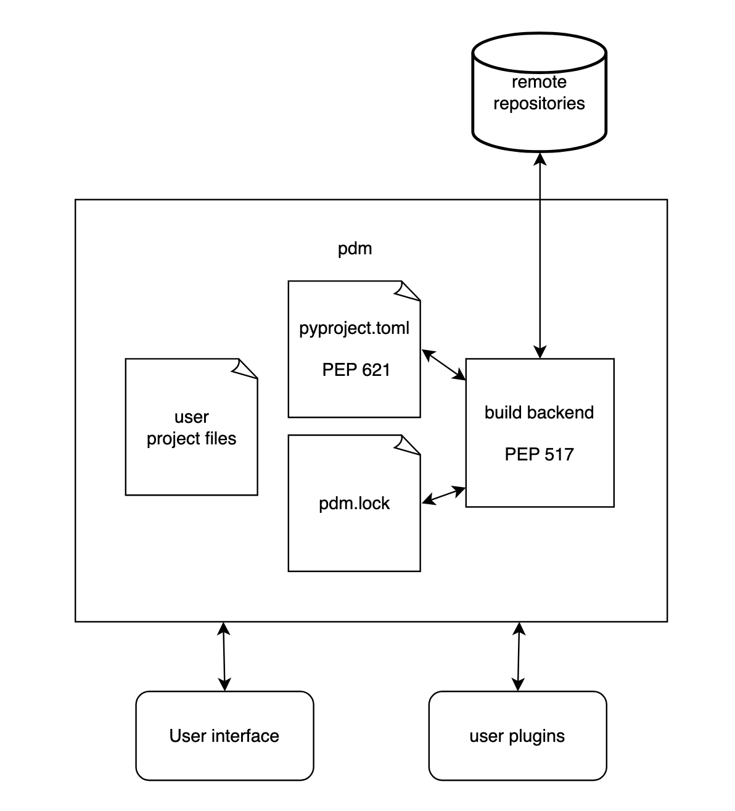

# Report for assignment 4

## Project

**Name:** PDM

**URL:** https://github.com/pdm-project/pdm

A package manager for python projects.

## Onboarding experience

We continued with the project we worked on in assignment 3. Below is our onboarding experience from the project report for assignment 3.

The project has a good CONTRIBUTING.md, where clear instructions are given
on how to organize ones contribution. The project recomends using it's own 
product (PDM) to ensure formatting and linting and to document changes in 
a specific `news` directory. There is nothing wrong with the CONTRIBUTING 
file, but there is a lack of documentation of certain modules and the code 
in general. The instructions and documentation for running and using the 
product are very good and the product works as intended. 

**How easily can you build the project? Briefly describe if everything worked as documented or not:**

- **a) Did you have to install a lot of additional tools to build the software?**

    No we only needed to install PDM, and it handled the rest for us.

- **b) Were those tools well documented?**

    PDM itself is well documented on the user side.

- **c) Were other components installed automatically by the build script?**

    PDM automatically installs all the necessary dependencies.

- **d) Did the build conclude automatically without errors?**

    Yes, this is very well handled by PDM.

- **e) How well do examples and tests run on your system(s)?**

    It runs excellently. With single scripts `pdm test` and `pdm coverage`, the tests and test coverage is executed with `pytest`.

## Overview of the architecture and purpose of pdm

The purpose of pdm is to provide a framework for python projects that handles package dependencies automatically. It also resolves the version requirements for all dependencies. The user specifies what version of what library that the project needs in a `pyproject.toml` file or by adding it with commands from the command line. Unlike other Python packaging tools, like Poetry and Hatch, pdm is not tightly integrated into a built-in build backend. Instead it uses PEP 517, a build-system independent format. pdm also allows the user to customize it with plugins.

    <figure>
        
        <figcaption>Diagram of the architecture of pdm.</figcaption>
    </figure>

**Key functions in pdm source code we described in the report for assigment 3:**
- `_parse_setup_cfg`is responsible for parsing a setup.cfg file. It extracts various metadata fields and stores them in a dictionary `result` that is returned.

- `do_lock`: locking in a package manager means locking down the versions of the dependencies that are used in the project. `do_lock` does that locking as well as updating the lock file. 

- `do_add` is the function that is run to add packages to the project, i.e. to `pyproject.toml`. The process of adding requirements requires checking dependecies (updating the lockfile, checking the dependency group), adding dependencies, and even parsing dependencies. The function also normalizes names and has different logic depending on what flag is given to the command. 

- `do_update` is the function that is run to update the packages in `pyproject.toml`. The function checks for potential errors with rather complicated boolean expressions at four separate times.

- `synchronize`: pdm is a package manager and includes several classes of `synchronizers` that take care of synching which packages to install, update or remove from the local environment. The `synchronize` function belongs to one of these classes and is used to decide which packages need to be installed or removed. More specifically the function compares the desired packages with the current working set through a helper function and creates a "to_do" dictionary that logs which packages need to be added, removed, or updated in the environment using the keys "add", "remove" or "update". It then splits these tasks into two lists: "sequential" and "parallel" tasks. It then iterates through all the tasks and attempts to complete them. If an installation fails then the function can either be set to continue with the remaining packages or break the installation depending on the users' input and preference. 
